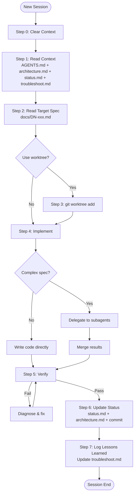
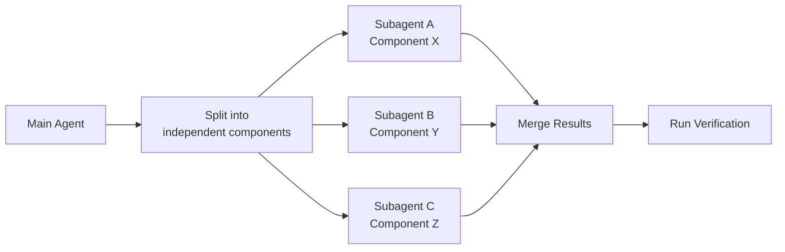

# Spec-Driven Implementation

Implements specs from a spec-driven project. Follows a strict workflow: read context → determine next action → execute with proper isolation.

## Workflow



### Step 0: New Session (Clear Context)

Implementation must start in a **new agent session**. The design-phase conversation carries irrelevant context (architecture debates, spec structure discussions). All necessary information is already captured in `docs/` files.

1. Tell the user to start a new conversation/session
2. In the new session, the agent loads only `AGENTS.md` + `docs/` files
3. Do not reference any prior conversation messages
4. If the user says "继续" or "continue" from a previous session, treat it as "open a new session, read the docs, and start implementing"

### Step 1: Read Context

Read these files in order:

1. `AGENTS.md` — conventions, spec table, project rules
2. `docs/architecture.md` — tech stack, constraints, decisions
3. `docs/status.md` — current progress, what's next
4. `docs/troubleshoot.md` — known pitfalls and solutions from prior specs

Determine:
- Which spec is current (the first unchecked item in status.md)
- What dependencies exist (does it depend on a prior spec?)
- What tech stack and conventions apply

### Step 2: Read the Target Spec

Read `docs/DN-xxx.md` for the current spec. Understand:
- **验证标准** — what success looks like (exact commands)
- **文件结构** — what files to create
- **核心代码** — what to write
- **设计说明** — why it's designed this way
- **数据模型** — data structures

### Step 3: Set Up Worktree

Use `git worktree` to isolate the spec's work:

```bash
# Create a worktree for this spec
git worktree add ../pagebird-d1 D1-worker-core
# Work in the worktree directory
cd ../pagebird-d1
```

Rules:
- One worktree per spec (not per file or per commit)
- Worktree name: `pagebird-{spec-short-name}` (e.g. `pagebird-d1-worker-core`)
- Branch name matches: `D1-worker-core`
- This keeps the main working directory clean and allows parallel spec work

If git is not initialized or the user prefers not to use worktrees, skip this step.

### Step 4: Implement

For each component in the spec:

1. Create the file structure as specified
2. Write code following the spec's core code section
3. Run verification commands from the spec's 验证标准 section
4. Fix any failures

**For complex specs, use subagents for parallel work:**



When to use subagents:
- Multiple independent files can be written in parallel (e.g. CLI modules config.js + api.js + mapping.js)
- Worker and CLI changes in the same spec (if spec touches both)
- Any task that doesn't depend on another task's output

When NOT to use subagents:
- Sequential dependencies (component B depends on component A)
- Verification must be done in a specific order
- The spec is small enough for one agent (< 200 lines total)

### Step 5: Verify

Run the exact verification commands from the spec. Every command must pass. If any fail:

1. Diagnose the failure
2. Fix the code
3. Re-run verification
4. Repeat until all pass

### Step 6: Update Status

After verification passes:

1. Update `docs/status.md`:
   - Mark the completed spec as `[x]`
   - Update "当前焦点" to the next spec
   - Update "下一步" with the next spec's first steps
   - Add any learnings to "踩坑记录"

2. If new tech decisions were made during implementation:
   - Update `docs/architecture.md` decision table

3. Commit the work:
   ```bash
   git add .
   git commit -m "feat: implement D{N} - {spec title}"
   ```

4. Clean up worktree (if used):
   ```bash
   cd /path/to/main/repo
   git worktree remove ../pagebird-d1
   git branch -d D1-worker-core
   git merge D1-worker-core
   ```

### Step 7: Log Lessons Learned & Export Session

Before closing the session:

#### 7a. Log pitfalls to troubleshoot.md

Summarize any pitfalls, workarounds, or non-obvious findings from this spec's implementation into `docs/troubleshoot.md`:

1. Review what went wrong or required extra effort during implementation
2. For each item, write a clear section with:
   - **Problem description** — what happened
   - **Root cause** — why it happened
   - **Solution / workaround** — how to fix or avoid it
3. Append to `docs/troubleshoot.md` (create if not exists)

#### 7b. Export session transcript

Export the full conversation transcript for future reference:

```bash
./scripts/export-session.sh D{N}-{spec-short-name}
```

This runs `opencode export <session-id> --sanitize` to save the raw JSON transcript to `docs/history/D{N}-{spec-short-name}.json`.

#### 7c. Commit everything

```bash
git add docs/troubleshoot.md docs/history/
git commit -m "docs: add troubleshooting and session export for D{N}"
```

This ensures future agent sessions (and human contributors) benefit from past experience without repeating the same mistakes.

## Development Norms

### Context Management

- Keep each agent session focused on one spec. Don't jump between specs.
- If context window fills up: update status.md → start new session → read context → continue.
- Use subagents for parallel work, not for splitting one small task.
- Each subagent gets a minimal, focused prompt: just the component spec, not the whole document.

### Code Quality

- Follow the conventions in AGENTS.md (language, dependencies, naming).
- Zero new npm dependencies unless explicitly allowed.
- Every function must handle its error cases (see spec's edge case table).
- Log/print errors to stderr, not stdout (CLI convention).

### Communication

- Report progress: which component you're working on, what verification passed/failed.
- If a spec is ambiguous, ask the user — don't guess.
- If you discover a design flaw, flag it before implementing a workaround.
- Keep status.md updated — it's the source of truth for the next agent session.
