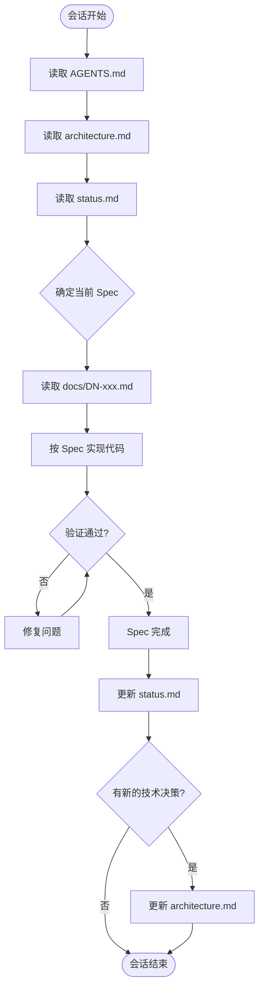

# AGENTS.md

本项目是 **OpenBird** — JotBird 的开源替代，将 Markdown 发布为可分享网页。

## 给 AI Agent 的规则

1. 开始工作前，读 `docs/status.md` 了解当前进度
2. 实现功能时，严格按 `docs/` 中对应 spec 编码，不自由发挥
3. 完成一个 milestone 后，更新 `docs/status.md`
4. 做了重要取舍时，记录到 `docs/architecture.md` 的决策表中

## 文档体系

所有设计、架构、进度都在 `docs/` 中。Agent 的记忆在会话间完全重置，docs/ 是唯一的跨会话上下文来源。

### 文件说明

```
docs/
├── D0-reference.md      # JotBird 逆向参考（只读，确认兼容性）
├── D1-worker-core.md    # Spec 1: Worker 后端
├── D2-cli-core.md       # Spec 2: CLI 核心
├── D3-images.md         # Spec 3: 图片上传
├── D4-namespace.md      # Spec 4: @username/slug
├── D10-publish-redesign.md  # Spec 10: 永久发布 + --slug/--namespace
├── D11-auto-username.md     # Spec 11: 自动派生 Username
├── D12-username-conflict.md # Spec 12: Username 冲突检测
├── architecture.md      # 项目基础、技术决策、开发环境
└── status.md            # 进度跟踪、当前焦点、踩坑记录
```

### 行为规则

| 时机 | Agent 必须做的事 |
|------|-----------------|
| 每次会话开始 | 读取 docs/ **全部文件** + AGENTS.md |
| 完成一个 Spec | 更新 `status.md` |
| 发现新模式/踩坑 | 更新 `status.md` |
| 做了技术决策 | 更新 `architecture.md` 决策表 |
| 用户说 "继续" / "continue" | 读取全部 docs，从 status.md 中断点继续 |

### 工作流程



#### 会话开始：按序读取

1. `AGENTS.md` — 规则和约定
2. `architecture.md` — 项目基础、架构、技术栈
3. `status.md` — 进度、下一步

#### 会话结束：必须更新

1. `status.md` — 标记完成项、写清下一步、踩坑记录
2. `architecture.md` — 仅在有新架构决策时更新

## Spec 开发顺序

按编号顺序实现，每个 spec 是一个可独立部署验证的 milestone：

| # | Spec | 交付物 | 验证方式 |
|---|------|--------|----------|
| 0 | [docs/D0-reference.md](docs/D0-reference.md) | 无（只读参考） | — |
| 1 | [docs/D1-worker-core.md](docs/D1-worker-core.md) | `worker/` 可部署 | `wrangler deploy` + curl 验证 |
| 2 | [docs/D2-cli-core.md](docs/D2-cli-core.md) | `cli/` 可运行 | `node cli/src/cli.js publish test.md` |
| 3 | [docs/D3-images.md](docs/D3-images.md) | 图片上传功能 | 发布含图片的 md |
| 4 | [docs/D4-namespace.md](docs/D4-namespace.md) | @username/slug | CLI --namespace 验证 |
| 5 | [docs/D5-deployment.md](docs/D5-deployment.md) | 远程部署验证 | wrangler deploy + curl 冒烟测试 |
| 6 | [docs/D6-documentation.md](docs/D6-documentation.md) | README.md | 新用户按文档从零完成发布 |
| 7 | [docs/D7-deploy-script.md](docs/D7-deploy-script.md) | deploy.sh 模板 | 一键部署脚本 |
| 8 | [docs/D8-landing-worker.md](docs/D8-landing-worker.md) | Worker 落地页服务 | curl / → 返回 site/index.html |
| 9 | [docs/D9-admin-register.md](docs/D9-admin-register.md) | Admin 创建用户 | `openbird register --email` |
| 10 | [docs/D10-publish-redesign.md](docs/D10-publish-redesign.md) | 永久发布 + --slug/--namespace | wrangler deploy + curl 验证 |
| 11 | [docs/D11-auto-username.md](docs/D11-auto-username.md) | 自动派生 Username | 注册后直接 publish --namespace |
| 12 | [docs/D12-username-conflict.md](docs/D12-username-conflict.md) | Username 冲突检测 | 注册冲突 username 返回 409 |

## 约定

| 项 | 值 |
|----|------|
| 语言 | JavaScript ESM, Node 18+ |
| 依赖 | 零 npm dependencies（CLI 和 Worker 均是） |
| API Key 前缀 | `ob_` |
| 配置目录 | `~/.config/openbird/` |
| 映射文件 | `.openbird` |
| 环境变量 | `OPENBIRD_API_URL` |
| 默认后端 | `https://openbird.jhao.space` |
| 页面域名 | `https://share.jhao.space` |
| Cloudflare 账户 | `8fee9be1204057d1830f7c85ffcdccbd` |
| 域名 | `jhao.space`（已在 CF 托管） |

## 目录结构（最终态）

```
pagebird/
├── AGENTS.md
├── docs/
│   ├── D0-reference.md
│   ├── D1-worker-core.md
│   ├── D2-cli-core.md
│   ├── D3-images.md
│   ├── D4-namespace.md
│   ├── D8-landing-worker.md
│   ├── D9-admin-register.md
│   ├── D10-publish-redesign.md
│   ├── D11-auto-username.md
│   ├── D12-username-conflict.md
│   ├── architecture.md
│   └── status.md
├── worker/
│   ├── src/index.js
│   ├── wrangler.toml
│   └── package.json
└── cli/
    ├── src/
    │   ├── cli.js
    │   ├── api.js
    │   ├── config.js
    │   ├── files.js
    │   ├── images.js
    │   ├── login.js
    │   └── mapping.js
    └── package.json
```
